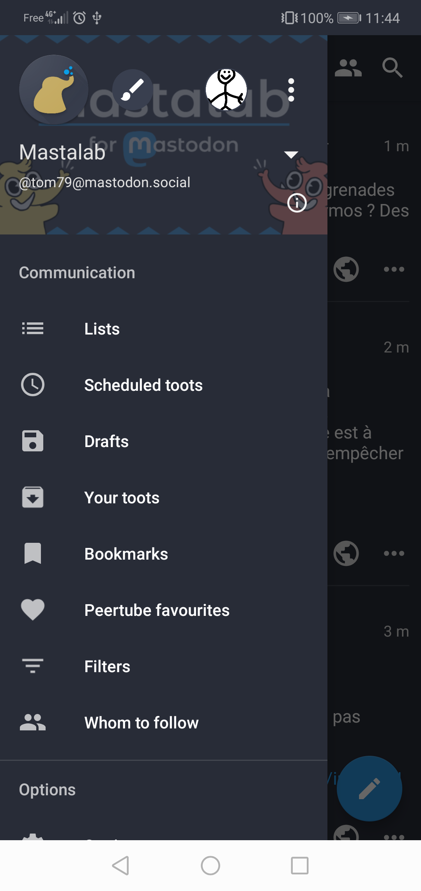
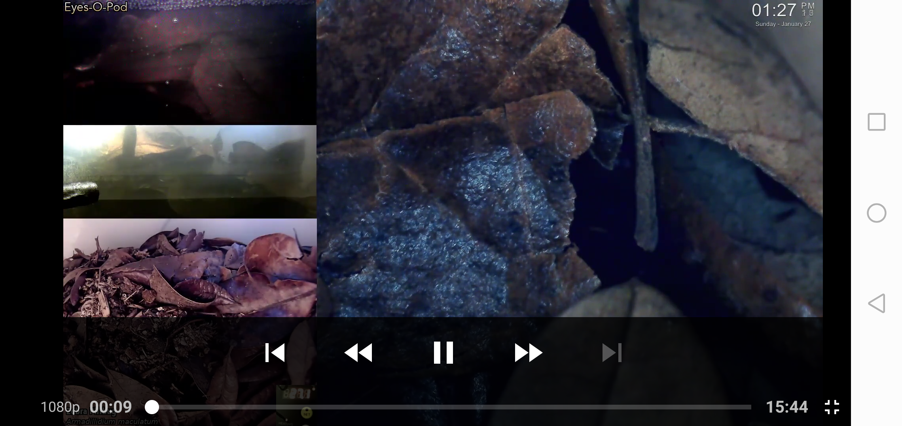
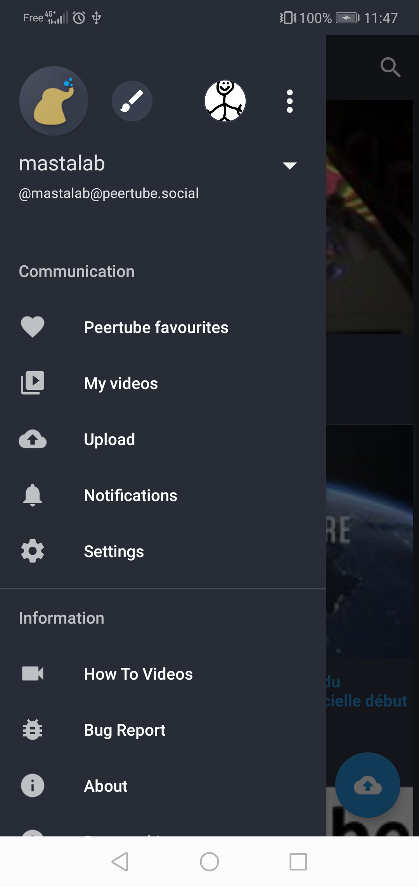
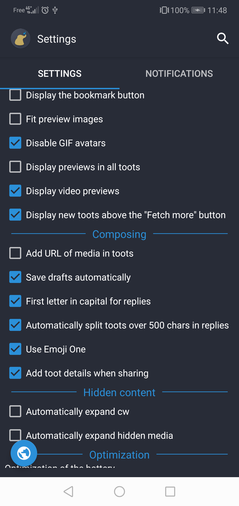

&nbsp;&nbsp;&nbsp;
&nbsp;&nbsp;&nbsp;
# Mastalab is a multi-accounts client for Mastodon, Pleroma, Peertube, GNU Social, Friendica and Pixelfed 

## Donate

 

## Download

&nbsp;&nbsp;

## Resources

[WIKI](https://fedilab.app/wiki/home/)

[Release notes](https://framagit.org/tom79/fedilab/tags)

&nbsp;&nbsp;&nbsp;&nbsp;&nbsp;&nbsp;

&nbsp;&nbsp;&nbsp;&nbsp;&nbsp;&nbsp;
&nbsp;&nbsp;&nbsp;&nbsp;&nbsp;&nbsp;
&nbsp;&nbsp;&nbsp;&nbsp;&nbsp;&nbsp;
&nbsp;&nbsp;&nbsp;&nbsp;&nbsp;&nbsp;
&nbsp;&nbsp;&nbsp;&nbsp;&nbsp;&nbsp;
&nbsp;&nbsp;&nbsp;&nbsp;&nbsp;&nbsp;
&nbsp;&nbsp;&nbsp;&nbsp;&nbsp;&nbsp;
&nbsp;&nbsp;&nbsp;&nbsp;&nbsp;&nbsp;

Lead developer: [framapiaf.org/@fedilab](https://framapiaf.org/@fedilab)
 
Developer: [mastodon.social@kasun](https://mastodon.social/@kasun)

## Backers

Thank you to all our backers! 🙏 [[Become a backer](https://opencollective.com/mastalab#backer)]

## Sponsors
Support this project by becoming a sponsor. Your logo will show up here with a link to your website. [[Become a sponsor](https://opencollective.com/mastalab#sponsor)]

